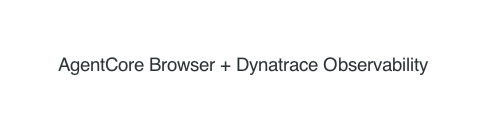
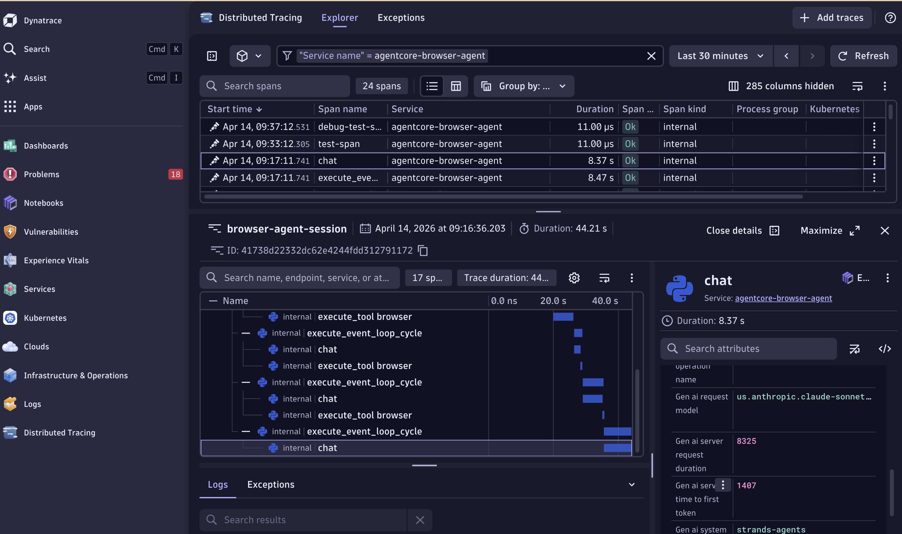
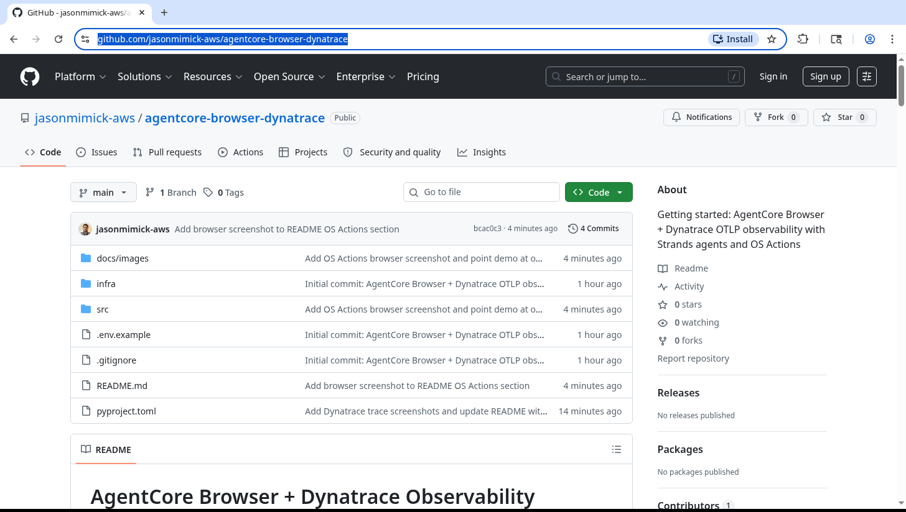

# AgentCore Browser + Dynatrace Observability

**Observe your AI browser agents end-to-end — from agent decision to page interaction — with OpenTelemetry traces exported to Dynatrace.**

This repo demonstrates how to build an AI-powered browser agent using [Amazon Bedrock AgentCore Browser](https://docs.aws.amazon.com/bedrock-agentcore/latest/devguide/browser-tool.html) and instrument it with [OpenTelemetry](https://opentelemetry.io/) traces exported to [Dynatrace](https://www.dynatrace.com/) via OTLP.

It covers two scenarios:

1. **Strands Agent** — An LLM-powered agent that navigates websites and extracts information, with every agent invocation traced.
2. **OS Actions** — The new [InvokeBrowser API](https://docs.aws.amazon.com/bedrock-agentcore/latest/devguide/browser-invoke.html) for OS-level mouse clicks, keyboard shortcuts, and full-desktop screenshots, each wrapped in its own trace span.

---

## Why Observability for Browser Agents?

AI agents browsing the web are distributed systems. An agent makes a decision, calls an LLM, sends a browser command, waits for a page to load, extracts content, and decides what to do next. Without observability, this is a black box.

By instrumenting with OpenTelemetry and exporting to Dynatrace, you get:

- **Trace timelines** showing the full agent session: prompt → LLM call → browser navigation → response
- **Span attributes** capturing what the agent did: URLs visited, clicks performed, screenshots taken
- **Error correlation** when things go wrong: which browser action failed, what was on screen
- **Performance insights** across agent runs: how long do navigations take, where are the bottlenecks

---

## Architecture



**Data flow:**
- Python agent creates OTel spans for each action (navigate, click, screenshot, etc.)
- Spans are exported via OTLP/HTTP to your Dynatrace tenant
- AgentCore Browser runs in AWS — your agent connects via CDP (WebSocket) for standard automation and via REST for OS-level actions

---

## Prerequisites

- Python 3.10+
- AWS credentials configured (`aws sts get-caller-identity`)
- [Claude Sonnet model access enabled](https://docs.aws.amazon.com/bedrock/latest/userguide/model-access-modify.html) in Amazon Bedrock
- A Dynatrace environment with an API token that has the `opentelemetryTrace.ingest` scope
- IAM permissions — apply `infra/iam-policy.json` to your IAM identity (update the `Resource` ARN with your account ID and region)

---

## Quick Start

### 1. Clone and install

```bash
git clone <this-repo>
cd agentcore-browser-dynatrace

# Install with uv
uv pip install -e .

# Install Playwright browsers
playwright install chromium
```

### 2. Configure environment

```bash
cp .env.example .env
```

Edit `.env`:

```
AWS_REGION=us-east-1
DT_OTLP_ENDPOINT=https://<your-tenant>.live.dynatrace.com/api/v2/otlp
DT_API_TOKEN=dt0c01.<your-token>
```

**Dynatrace token setup:** In your Dynatrace environment, go to *Access Tokens → Generate new token* and enable the `opentelemetryTrace.ingest` scope.

### 3. Run the Strands browser agent

```bash
cd src
python agent_browser.py
```

This launches a Strands agent that:
1. Creates an AgentCore Browser session
2. Navigates to the AgentCore documentation
3. Summarizes the page content using Claude
4. Exports the full trace to Dynatrace

### 4. Run the OS Actions demo

```bash
cd src
python os_actions_demo.py
```

This demonstrates the new `InvokeBrowser` API:
1. Creates a browser session and navigates via Playwright CDP
2. Takes an OS-level screenshot (full desktop, not just viewport)
3. Performs a mouse click at specific coordinates
4. Executes a keyboard shortcut (`Ctrl+A`)
5. Takes a final screenshot
6. Each action is a separate OTel span with status and metadata

Screenshots are saved to `screenshots/`.

---

## What You'll See in Dynatrace

After running either demo, open your Dynatrace environment and navigate to **Distributed Traces**.

### Strands Agent Trace


The trace shows the full agent reasoning loop — LLM calls, browser tool executions, and event loop cycles — all nested under the parent `browser-agent-session` span. Strands automatically adds its own OTel instrumentation, so you get rich detail including the model used (`us.anthropic.claude-sonnet-...`) and token timing.

Span attributes include:
- `agent.prompt` — the prompt sent to the agent
- `agent.target_url` — the URL the agent was asked to visit
- `agent.response_length` — length of the agent's response
- `response_preview` event — first 500 chars of the response

### OS Actions Trace



Each OS-level action gets its own span, making it easy to see exactly what the agent did and how long each action took.

```
os-actions-session (parent)
  ├── cdp-navigate
  ├── os-screenshot
  ├── os-mouse-click
  ├── os-key-shortcut
  └── os-screenshot-final
```

Each child span captures:
- `screenshot.status`, `screenshot.path` — for screenshot actions
- `click.status`, `click.x`, `click.y` — for mouse actions
- `shortcut.status`, `shortcut.keys` — for keyboard actions
- `browser.session_id` — the AgentCore Browser session ID

---

## Project Structure

```
agentcore-browser-dynatrace/
├── .env.example              # Environment config template
├── pyproject.toml            # uv-managed Python project
├── src/
│   ├── otel_setup.py         # OTel TracerProvider → Dynatrace OTLP
│   ├── agent_browser.py      # Strands agent + AgentCore Browser
│   └── os_actions_demo.py    # InvokeBrowser OS Actions demo
├── infra/
│   └── iam-policy.json       # IAM policy for AgentCore Browser
└── screenshots/              # OS Action screenshots (gitignored)
```

---

## Key Concepts

### AgentCore Browser

A managed Chrome browser running in AWS. Your agent connects to it via:
- **CDP (Chrome DevTools Protocol)** over WebSocket — for standard browser automation (navigate, click DOM elements, fill forms)
- **InvokeBrowser REST API** — for OS-level actions (mouse, keyboard, screenshots) that go beyond what CDP can do

### OS Actions (New!)

The [InvokeBrowser API](https://docs.aws.amazon.com/bedrock-agentcore/latest/devguide/browser-invoke.html) adds OS-level control:

| Action | Description |
|--------|-------------|
| `mouseClick` | Click at OS coordinates (LEFT/RIGHT/MIDDLE) |
| `mouseMove` | Move cursor to coordinates |
| `mouseDrag` | Drag from start to end position |
| `mouseScroll` | Scroll at position |
| `keyType` | Type a string of text |
| `keyPress` | Press a key N times |
| `keyShortcut` | Key combination (e.g., `["ctrl", "s"]`) |
| `screenshot` | Full desktop screenshot (PNG) |

This is useful for interacting with native OS dialogs, print prompts, right-click menus, and anything outside the browser DOM.

Here's an actual screenshot captured by AgentCore Browser's OS-level `screenshot` action during the demo — it navigated to this project's GitHub repo:



### OpenTelemetry → Dynatrace

Dynatrace natively supports OTLP trace ingestion. The `otel_setup.py` module configures:
- `OTLPSpanExporter` pointing at your Dynatrace tenant's `/api/v2/otlp/v1/traces` endpoint
- `BatchSpanProcessor` for efficient export
- `Resource` with `service.name` for identification in Dynatrace

---

## Going Further

- **CloudWatch metrics** — AgentCore Browser emits session counts, duration, error rates, and resource utilization to CloudWatch. Connect these to Dynatrace via the [AWS CloudWatch integration](https://docs.dynatrace.com/docs/setup-and-configuration/setup-on-cloud-platforms/amazon-web-services).
- **Session recording** — Enable session recording to S3 for DOM replay, console logs, and network events. See [Session Recording and Replay](https://docs.aws.amazon.com/bedrock-agentcore/latest/devguide/browser-session-recording.html).
- **Live View** — Watch your agent in real-time through the [AgentCore Browser Console](https://us-west-2.console.aws.amazon.com/bedrock-agentcore/builtInTools).

---

## References

- [AgentCore Browser Documentation](https://docs.aws.amazon.com/bedrock-agentcore/latest/devguide/browser-tool.html)
- [OS Actions (InvokeBrowser) API](https://docs.aws.amazon.com/bedrock-agentcore/latest/devguide/browser-invoke.html)
- [Strands Agents](https://github.com/strands-agents/strands-agents)
- [Dynatrace OpenTelemetry Integration](https://docs.dynatrace.com/docs/extend-dynatrace/opentelemetry)
- [What's New: AgentCore Browser OS Actions](https://aws.amazon.com/about-aws/whats-new/2026/04/agentcore-browser-os-actions/)
